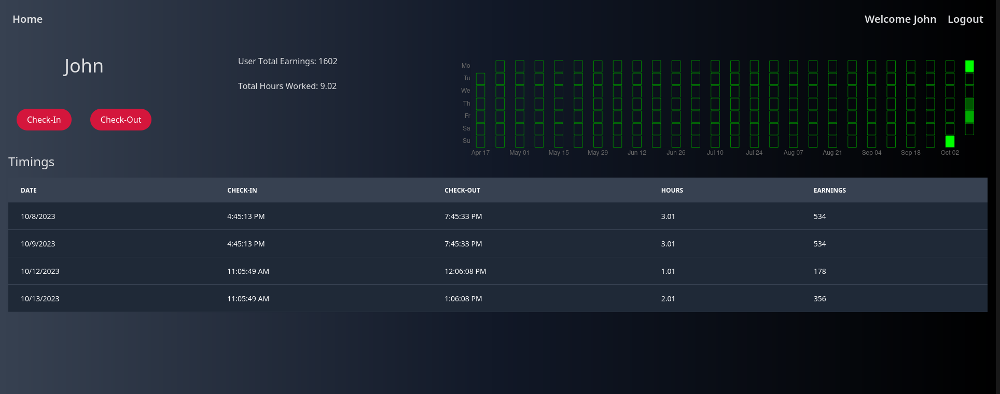

# TimeKeeper

Timekeeper is a simple webapp for tracking employee time. Users can checkin and get their checkin history.
Features a nice github like matrix chart for visualization.

Written with C# ASP.NET, Svelte/kit, PostgreSQL and [[Skeleton](https://skeleton.dev)].

Example:

Dashboard:

Login Page:

